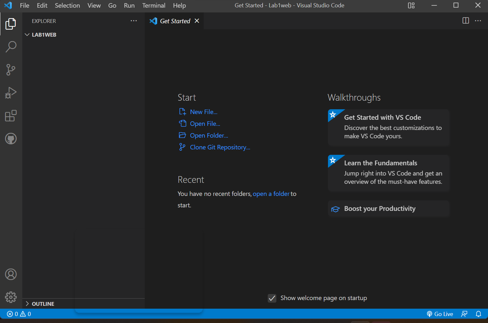
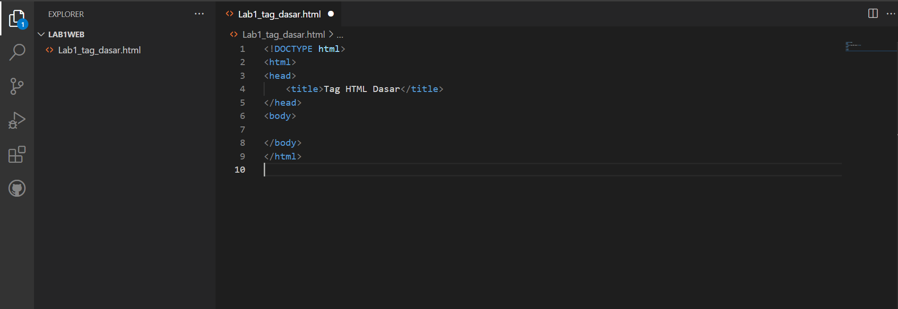
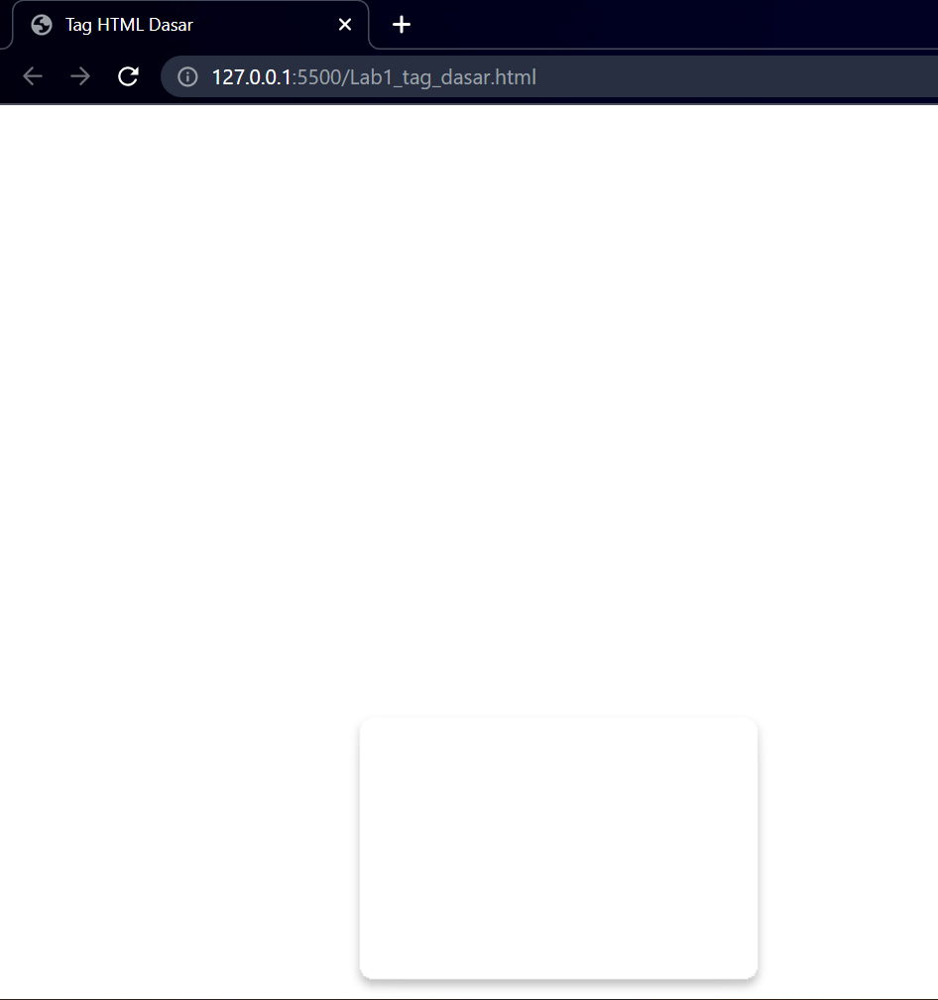
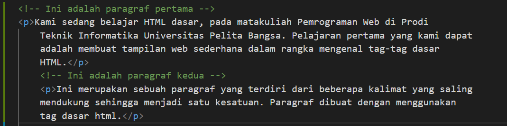
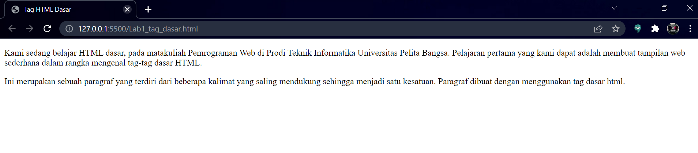
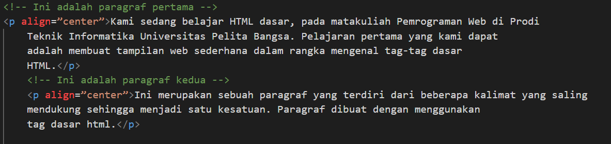

# Nama : SHOBAHUS SOLICHIN
# NIM : 312010076
# Kelas : TI.20.A1
# Matkul : Pemrograman Web

## **Langkah-Langkah Praktikum**
Persiapan membuka VSCode dan Browser

Kemudian buat file baru dengan nama Lab1_tag_dasar.html dan tambahkan dasar dokumen HTML. 

# Modul Praktikum Pemrograman Web

kemudian selanjutnya,buka file tersebut pada web browser misalnya **google chrome.** 

# **1. Membuat Paragraf**

selanjutnya simpan kembali perubahannya, dan lakukan refresh pada web browser,lihat hasilnya.

# Modul Praktikum Pemrograman Web

Kemudian atur atribut paragraf seperti berikut, dan amati perubahanya.

Simpan kembali dan amati perubahannya dengan melakukan refresh pada web browser. 
Selanjutnya silakan ubah-ubah nilai atributnya (*align => justify, left, right, dan center*) untuk melihat perbedaan lainnya. 